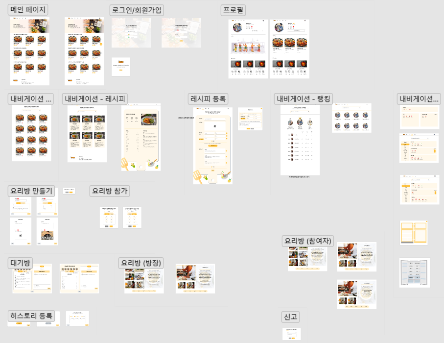
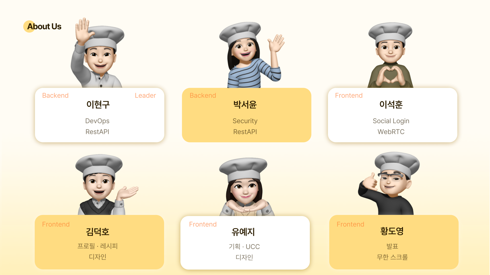

# 쿠게더 - 함께 요리하는 라이브 쿠킹 플랫폼

## [🍳지금 요리하러 가기 !](http://i8b206.p.ssafy.io)

## [📺 소개 영상 (UCC)](https://youtu.be/u9HH0QnkUlQ)


# 📢 프로젝트 소개

### ✔️ **프로젝트 명**

---


### ✔️ **프로젝트 일정**

---

### **2023-01-03(화) ~ 2023-02-17(금) (7주)**

### ✔️ 협업 툴

---

- Git
- Notion
- JIRA
- MatterMost
- Webex

### ✔️ 기술

---

1. Querydsl을 이용한 Dynamic Query 성능 최적화
2. Spring Security + OAuth2 + JWT 소셜 로그인 구현
3. Jenkins를 이용한 CI/CD Pipeline 구축
4. S3를 이용한 파일 업로드 구현

## ⭐ 쿠게더 기능

---

1. 사용자가 가진 재료를 가상 공간의 나만의 냉장고에 등록
2. 나만의 커스텀 레시피 등록
3. 내 재료를 활용할 수 있는 요리방 추천
4. 가장 빠르게 참가할 수 있는 요리방 추천
5. 사용자가 선호하는 카테고리 기반 요리방 추천
6. 다른 사용자와 함께하는 라이브 쿠킹
7. 내가 사용한 재료를 한 번에 삭제
8. 요리에 참여한 참여자 리스트와 요리방 정보 히스토리 제공
9. 다른 사용자 팔로우
10. 요리방 / 레시피 검색
11. 요리에 필요한 재료가 없다면 구매 링크 연결

## 🎨 화면 디자인

---




## 💥 기술 스택

---


```jsx
FE : React(v17.0.2), Redux toolkit, React-router-dom(v5.3.4), styled-components(v5.3.6)

BE : Java(JDK 11), SpringBoot (2.7.7), SpringDataJPA, QueryDSL (5.0.0), Swagger (2.9.2)

DB : MySQL(v8.0.30)

Storage : S3 Bucket

WebRTC : openvidu(2.25.0)

IDE: IntelliJ, VSCode

DevOps : Docker(20.10.23), Jenkins(2.375.3), nginx(1.18.0), AWS ec2 
```

```jsx
1. Querydsl을 이용한 Dynamic Query 성능 최적화

2. Spring Security + OAuth2 + JWT 소셜 로그인 구현

3. S3를 이용한 파일 업로드 구현

4. Jenkins를 이용한 CI/CD Pipeline 구축
```

## 🔔 서비스 플로우


## 📙 [기능 명세](https://www.notion.so/413d4eca2d46491c83f0c4543bee066c)


## 💾 [ERD](https://www.notion.so/ERD-b3acd3fae0124044b38b357ee4d9c99c)


## 📜  [API Docs](https://www.notion.so/API-Docs-a933fc057ec446b5bf9c2ceb738b0809)


## 📁 디렉토리 구조


```jsx
📦frontend
 ┣ 📂src
 ┃ ┣ 📂assets
 ┃ ┣ 📂components
 ┃ ┃ ┣ 📂Btn
 ┃ ┃ ┃ ┣ 📂CarouselBtn
 ┃ ┃ ┃ ┣ 📂FloatBtn
 ┃ ┃ ┃ ┗ 📂NextBtn
 ┃ ┃ ┣ 📂Modal
 ┃ ┃ ┃ ┣ 📂AllMyIngredientsModal
 ┃ ┃ ┃ ┣ 📂ConfirmModal
 ┃ ┃ ┃ ┣ 📂CookRoomEnterModal
 ┃ ┃ ┃ ┣ 📂Follow
 ┃ ┃ ┃ ┣ 📂RecipeModal
 ┃ ┃ ┃ ┣ 📂ReportModal
 ┃ ┃ ┃ ┣ 📂StreamFinishModal
 ┃ ┃ ┃ ┣ 📂StreamHistoryModal
 ┃ ┃ ┃ ┗ 📂StreamModal
 ┃ ┃ ┣ 📂Nav
 ┃ ┃ ┣ 📂Rank
 ┃ ┃ ┣ 📂Recipe
 ┃ ┃ ┃ ┣ 📂Modal
 ┃ ┃ ┃ ┗ 📂Register
 ┃ ┃ ┣ 📂Room
 ┃ ┃ ┃ ┣ 📂chat
 ┃ ┃ ┃ ┣ 📂dialog-extension
 ┃ ┃ ┃ ┣ 📂models
 ┃ ┃ ┃ ┣ 📂stream
 ┃ ┃ ┃ ┣ 📂toolbar
 ┃ ┃ ┃ ┣ 📂verticalCarousel
 ┃ ┃ ┗ 📂Wrapper
 ┃ ┣ 📂hooks
 ┃ ┣ 📂pages
 ┃ ┃ ┣ 📂Main
 ┃ ┃ ┣ 📂MakeCookRoom
 ┃ ┃ ┣ 📂MyIngredientsManage
 ┃ ┃ ┣ 📂NotFound
 ┃ ┃ ┣ 📂Recipe
 ┃ ┃ ┣ 📂Room
 ┃ ┃ ┣ 📂Search
 ┃ ┃ ┗ 📂User
 ┃ ┃ ┃ ┣ 📂Login
 ┃ ┃ ┃ ┣ 📂Profile
 ┃ ┃ ┃ ┗ 📂SignIn
 ┃ ┣ 📂store
 ┃ ┣ 📂styles
 ┃ ┣ 📂utils
 ┃ ┣ 📜App.css
 ┃ ┣ 📜App.js
 ┃ ┣ 📜App.test.js
 ┃ ┣ 📜index.css
 ┃ ┣ 📜index.js
 ┃ ┣ 📜logo.svg
 ┃ ┣ 📜reportWebVitals.js
 ┃ ┗ 📜setupTests.js
 ┣ 📜.eslintrc.js
 ┣ 📜.gitignore
 ┣ 📜.prettierrc.js
 ┣ 📜Dockerfile
 ┣ 📜nginx.conf
 ┣ 📜package-lock.json
 ┣ 📜package.json
 ┗ 📜README.md
```

```jsx
📦backend
 ┣ 📂.gradle
 ┣ 📂.idea
 ┣ 📂build
 ┃ ┣ 📂generated
 ┃ ┃ ┗ 📂querydsl
 ┃ ┗ 📂tmp
 ┃ ┃ ┗ 📂compileQuerydsl
 ┣ 📂gradle
 ┣ 📂out
 ┣ 📂src/main/java/coogether/backend
 ┃ ┣ 📂config
 ┃ ┣ 📂controller
 ┃ ┣ 📂domain
 ┃ ┣ 📂dto
 ┃ ┣ 📂repository
 ┃ ┃ ┣ 📂cookingroom
 ┃ ┃ ┣ 📂follow
 ┃ ┃ ┣ 📂history
 ┃ ┃ ┣ 📂ingredient
 ┃ ┃ ┣ 📂ingredientlist
 ┃ ┃ ┣ 📂myingredientmanage
 ┃ ┃ ┣ 📂recipe
 ┃ ┃ ┣ 📂recipestep
 ┃ ┃ ┣ 📂report
 ┃ ┃ ┣ 📂token
 ┃ ┃ ┣ 📂user
 ┃ ┃ ┗ 📂userjoinlist
 ┃ ┣ 📂service
 ┃ ┗ 📜BackendApplication.java
 ┣ 📂src
 ┃ ┣ 📂main
 ┃ ┃ ┗ 📂resources
 ┃ ┃ ┃ ┣ 📜application.yml
 ┃ ┃ ┃ ┗ 📜keystore.p12
 ┃ ┗ 📂test
 ┣ 📜.gitignore
 ┣ 📜build.gradle
 ┣ 📜Dockerfile
 ┣ 📜gradlew
 ┣ 📜gradlew.bat
 ┗ 📜settings.gradle
```

## ✨ EC2 포트


| PORT | 이름 |
| --- | --- |
| 443 | HTTPS |
| 80 | HTTP - HTTPS로 리다이렉트 |
| 8443 | Openvidu |
| 3306 | MySQL |
| 9999 | Jenkins |
| 9000 | Spring boot Docker Container |
| 3000 | React, NginX Docker Container |

## 🚢 **팀원**


